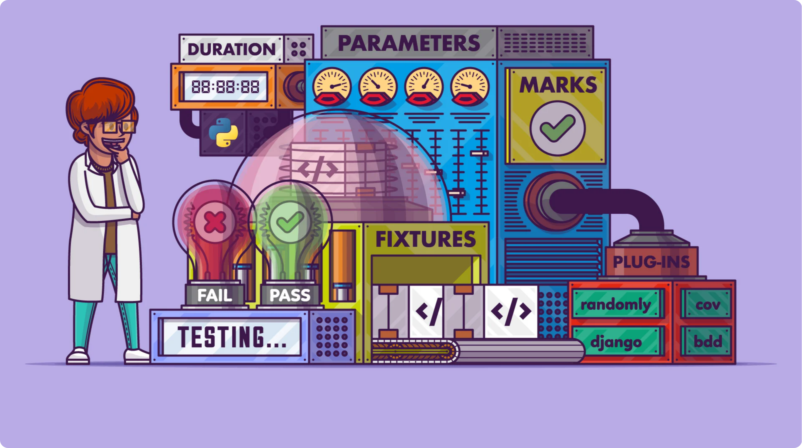

<div align="center">

</div>

---

Testing your code brings a wide variety of benefits. It increases your confidence that the code behaves as you expect and ensures that changes to your code won’t cause regressions. Writing and maintaining tests is hard work, so you should leverage all the tools at your disposal to make it as painless as possible. pytest is one of the best tools that you can use to boost your testing productivity.

<div align="center">
  
</div>

## ⚙️ Virtual env setup

### 🪟 Windows

- Create an virtual env using venv module.
  ```shell
  cd C:\python311
  python.exe -m venv %USERPROFILE%\venvs\frameworkenv
  ```
- Activate the virtual env using 'activate' exe within Scripts dir.

  ```shell
  cd %USERPROFILE%\venvs\frameworkenv\Scripts
  activate

  or

  %USERPROFILE%\venvs\frameworkenv\Scripts\activate
  ```

- Verify the Python version within new virtual env.

  ```shell
  (frameworkenv) C:\Users\jagadeesh\venvs\frameworkenv\Scripts>python --version
  Python 3.11.2
  ```

- Deactivate the virtual env using the deactivate executable.

  ```shell
  (frameworkenv) C:\Users\jagadeesh\venvs\frameworkenv\Scripts> deactivate

  or
  %USERPROFILE%\venvs\frameworkenv\Scripts\deactivate
  ```

### 🚥 macOS

- Create an virtual env using venv module.
  ```shell
  tbd
  ```
- Activate the virtual env using 'activate' exe within Scripts dir.
  ```shell
  tbd
  ```
- Verify the Python version within new virtual env.

  ```shell
  tbd
  ```

- Deactivate the virtual env using the deactivate executable.
  ```shell
  tbd
  ```

🌟 Make sure to be in venv
`pip install pytest`

### Run pytest

```shell
# less details
pytest
# test_widget.py .

# more details
pytest -v
# test_widget.py::test_widget_functions_as_expected PASSED
```

### Why not built in unittest?

```python
# test_with_unittest.py

from unittest import TestCase

class TryTesting(TestCase):
    def test_always_passes(self):
        self.assertTrue(True)

    def test_always_fails(self):
        self.assertTrue(False)
```

```shell
(frameworkenv) C:\pytest>python -m unittest discover
F.
======================================================================
FAIL: test_always_fails (test_with_unittet.TryTesting.test_always_fails)
----------------------------------------------------------------------
Traceback (most recent call last):
  File "C:\data\jagadeesh\pytest\test_with_unittet.py", line 10, in test_always_fails
    self.assertTrue(False)
AssertionError: False is not true

----------------------------------------------------------------------
Ran 2 tests in 0.011s

FAILED (failures=1)
```

#### What we did? 🤔

1. Import the `TestCase` class from `unittest`
2. Create `TryTesting`, a subclass of `TestCase`
3. Write a method in `TryTesting` for each test
4. Use one of the `self.assert*` methods from `unittest.TestCase` to make assertions

That’s a significant amount of code to write, and because it’s the minimum you need for any test, you’d end up writing the same code over and over. **pytest simplifies this workflow by allowing you to use normal functions and Python’s assert keyword directly:**

```python
# test_with_pytest.py

def test_always_passes():
    assert True

def test_always_fails():
    assert False
```

That’s it. You don’t have to deal with any imports or classes. All you need to do is include a function with the test\_ prefix. Because you can use the assert keyword, you don’t need to learn or remember all the different self.assert\* methods in unittest, either. If you can write an expression that you expect to evaluate to True, and then pytest will test it for you.

Not only does pytest eliminate a lot of boilerplate, but it also provides you with a much more detailed and easy-to-read output.

```shell
(frameworkenv) C:\data\jagadeesh\pytest>pytest
================================== test session starts ===================================
platform win32 -- Python 3.11.2, pytest-7.2.1, pluggy-1.0.0
rootdir: C:\data\jagadeesh\pytest
collected 2 items

test_with_pytest.py .F                                                              [100%]

======================================== FAILURES ========================================
___________________________________ test_always_fails ____________________________________

    def test_always_fails():
>       assert False
E       assert False

test_with_pytest.py:7: AssertionError
================================ short test summary info =================================
FAILED test_with_pytest.py::test_always_fails - assert False
============================== 1 failed, 1 passed in 0.10s ===============================
```

## Reference

- [Effective Python Testing With Pytest](https://realpython.com/pytest-python-testing/)
- Tbd
